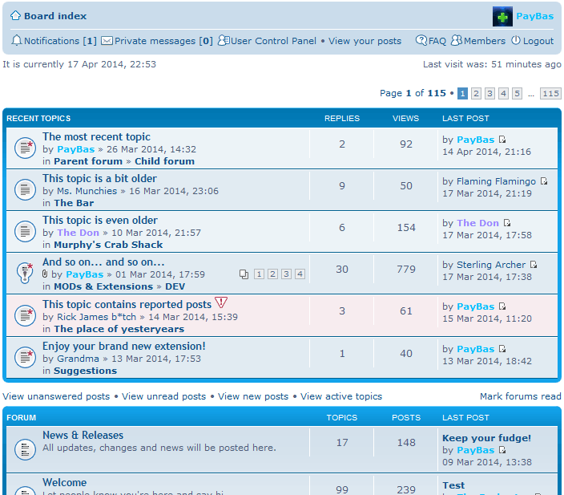

Recent Topics for phpBB 3.1
============

Extension for phpBB 3.1 to display recent topics.

#### Based on NV Recent Topics for phpBB 3.0, by Joas Schilling ([nickvergessen](https://github.com/nickvergessen))

## Features
- Adds a list of recent (or unread) topics to the index page.
- ACP module to change:
  - number of topics to show
  - max. number of pages
  - exclusion of topics (by ID)
  - display parent forums in the row
  - only show unread topics
- Inherits all styling from regular "viewforum" templates

#### Requirements
- >= phpBB 3.1-dev
- >= PHP 5.4

#### Languages supported
- English
- German
- Spanish

#### To do list
- Add compatibility for topic prefixes and allow exclusion/inclusion based on predefined prefixes.

## Installation
You can install this on the latest copy of the develop branch (phpBB 3.1-dev) by following the steps below.

**Manual:**

1. If there is not yet an `./ext/paybas/recenttopics/` folder tree starting from your board root, create one.
2. Copy the entire contents of this repo into that folder you just created (You can leave out the *.md files, screenshot.png, .gitignore, and the .git folder).
3. Navigate in the ACP to `Customise -> Manage extensions -> Extensions`.
4. Click Enable.

**Git:**

1. From the board root run the following git command:
`git clone https://github.com/paybas/RecentTopics.git ext/paybas/recenttopics`
2. Go to `ACP -> Customise -> Manage extensions -> Extensions`
3. Click Enable.

## Uninstallation
In the ACP -> Customise -> Manage Extensions -> Extensions module, you can click one of the following:
- **Disable:** This keeps the Extension data and schema intact but prevents it from running. The whole thing kinda falls apart. The administration area will be unavailable. When you re-enable the extension, all functionality will become active again.
- **Delete data:** This destroys any data added by the extension, and reverts any schema changes it made. You can re-enable the extension, but all the settings of this extension will be gone.

### License
[GNU General Public License v2](http://opensource.org/licenses/GPL-2.0)

© 2014 - PayBas